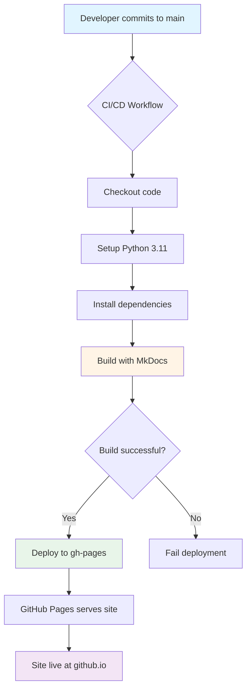

# Documentation Deployment Guide

Complete guide to deploying the n8n MCP Workflow Builder documentation to GitHub Pages with CI/CD automation.

---

## Overview

This project uses **MkDocs Material** with automated GitHub Actions deployment to GitHub Pages. Every push to the `main` branch automatically builds and deploys the documentation.

**Deployment Stack:**

- **Static Site Generator:** MkDocs Material
- **Hosting:** GitHub Pages
- **CI/CD:** GitHub Actions
- **URL:** `https://salacoste.github.io/mcp-n8n-workflow-builder`

---

## Quick Start

### Prerequisites

- GitHub repository with documentation in `docs/` directory
- MkDocs Material configuration file (`mkdocs.yml`)
- Python 3.11+ for local development

### Deploy to Production

```bash
# 1. Ensure all changes are committed
git status

# 2. Push to main branch
git push origin main

# 3. Monitor deployment
gh run watch

# 4. Verify deployment
open https://salacoste.github.io/mcp-n8n-workflow-builder
```

**Deployment Time:** ~2-3 minutes

---

## Architecture

### Deployment Pipeline



### Build Process

```
1. Checkout repository (fetch-depth: 0 for git revision dates)
    ↓
2. Setup Python 3.11 with pip caching
    ↓
3. Install MkDocs dependencies from requirements.txt
    ↓
4. Run: mkdocs build --strict --verbose
    ↓
5. Validate: No errors or warnings
    ↓
6. Deploy: Upload to gh-pages branch
    ↓
7. GitHub Pages: Serve static site
```

---

## GitHub Actions Workflow

### Current Deployment Workflow

**File:** `.github/workflows/deploy-docs.yml`

**Triggers:**

- Push to `main` branch with changes to:
  - `docs/**` (any documentation file)
  - `mkdocs.yml` (configuration changes)
  - `.github/workflows/deploy-docs.yml` (workflow changes)

**Manual trigger:** Available via GitHub Actions UI (workflow_dispatch)

**Key Features:**

- **Strict Mode:** `mkdocs build --strict` fails on warnings
- **Git History:** Full fetch for revision dates
- **Caching:** Python dependencies cached for faster builds
- **Atomic Deployment:** Uses peaceiris/actions-gh-pages@v3
- **Bot Identity:** Commits as `github-actions[bot]`

### Workflow Configuration

```yaml
name: Deploy Documentation

on:
  push:
    branches: [main]
    paths:
      - 'docs/**'
      - 'mkdocs.yml'
      - '.github/workflows/deploy-docs.yml'
  workflow_dispatch:

permissions:
  contents: write
  pages: write
  id-token: write

jobs:
  deploy:
    runs-on: ubuntu-latest
    timeout-minutes: 15

    steps:
      - name: Checkout repository
        uses: actions/checkout@v4
        with:
          fetch-depth: 0  # Full history for git-revision-date plugin

      - name: Setup Python
        uses: actions/setup-python@v4
        with:
          python-version: '3.11'

      - name: Install dependencies
        run: pip install -r requirements.txt

      - name: Build documentation
        run: mkdocs build --strict --verbose

      - name: Deploy to GitHub Pages
        uses: peaceiris/actions-gh-pages@v3
        with:
          github_token: ${{ secrets.GITHUB_TOKEN }}
          publish_dir: ./site
          publish_branch: gh-pages
          user_name: 'github-actions[bot]'
          user_email: 'github-actions[bot]@users.noreply.github.com'
          commit_message: 'docs: deploy documentation ${{ github.sha }}'
```

---

## Local Development

### Setup Development Environment

```bash
# 1. Clone repository
git clone https://github.com/salacoste/mcp-n8n-workflow-builder.git
cd mcp-n8n-workflow-builder

# 2. Install Python dependencies
pip install -r requirements.txt

# Or install individually:
pip install mkdocs-material
pip install mkdocs-git-revision-date-localized-plugin
pip install mkdocs-minify-plugin
```

### Serve Documentation Locally

```bash
# Start development server
mkdocs serve

# Server starts at: http://localhost:8000
# Live reload enabled - changes appear automatically
```

**Development Server Features:**

- **Live Reload:** Automatic refresh on file changes
- **Fast Builds:** Incremental builds during development
- **Error Display:** Build errors shown in browser
- **Port Configuration:** Use `mkdocs serve -a 0.0.0.0:8080` for custom port

### Build for Production

```bash
# Build static site with strict validation
mkdocs build --strict --verbose

# Output directory: ./site/
# Contains: HTML, CSS, JS, images, search index
```

**Build Validation:**

```bash
# Check for warnings
mkdocs build --strict 2>&1 | grep -i "warning"

# Verify output
ls -lh site/
find site -name "*.html" | wc -l

# Check total size
du -sh site/
```

---

## Pre-Deployment Checklist

### 1. Content Validation

- [ ] All documentation pages complete and reviewed
- [ ] Code examples tested and working
- [ ] Screenshots current and accurate
- [ ] No placeholder content (TODO, Lorem ipsum)
- [ ] Spelling and grammar checked
- [ ] Technical accuracy verified

**Validation Commands:**

```bash
# Build in strict mode (fails on warnings)
mkdocs build --strict

# Check for TODOs
grep -r "TODO\|FIXME\|XXX" docs/

# Check for placeholder content
grep -r "Lorem ipsum" docs/
```

### 2. Build Quality

- [ ] Build completes without errors
- [ ] Build completes without warnings
- [ ] All pages render correctly
- [ ] Search index generated successfully
- [ ] Navigation structure correct

**Quality Checks:**

```bash
# Strict build with verbose output
mkdocs build --strict --verbose

# Verify search index
ls -lh site/search/search_index.json

# Check navigation
cat site/sitemap.xml
```

### 3. Link Validation

- [ ] All internal links working
- [ ] External links accessible
- [ ] No broken anchors
- [ ] Cross-references valid

**Link Checking:**

```bash
# Install link checker
npm install -g markdown-link-check

# Check all markdown files
find docs -name "*.md" -exec markdown-link-check {} \;

# Or use broken-link-checker on built site
npm install -g broken-link-checker
mkdocs serve &
sleep 5
blc http://localhost:8000 -ro
```

### 4. Performance Validation

- [ ] Total site size <20MB
- [ ] Individual pages <500KB
- [ ] Images optimized (<200KB each)
- [ ] CSS/JS minified
- [ ] Load time <2 seconds

**Performance Checks:**

```bash
# Check total size
du -sh site/

# Find largest files
find site -type f -exec du -h {} + | sort -rh | head -20

# Verify minification
ls -lh site/assets/stylesheets/*.css
ls -lh site/assets/javascripts/*.js
```

### 5. Accessibility Validation

- [ ] WCAG 2.1 AA compliance
- [ ] Alt text on all images
- [ ] Proper heading hierarchy (H1 → H2 → H3)
- [ ] Keyboard navigation working
- [ ] Screen reader compatible

**Accessibility Testing:**

```bash
# Install pa11y
npm install -g pa11y-ci

# Serve site locally
mkdocs serve &
sleep 5

# Run accessibility tests
pa11y http://localhost:8000
pa11y http://localhost:8000/getting-started/
pa11y http://localhost:8000/api/overview/
```

### 6. SEO Validation

- [ ] Page titles descriptive and unique
- [ ] Meta descriptions on all pages
- [ ] Keywords defined appropriately
- [ ] sitemap.xml generated
- [ ] robots.txt configured (if needed)

**SEO Checks:**

```bash
# Verify sitemap
cat site/sitemap.xml | head -50

# Check for duplicate titles
grep -r "<title>" site/ | sort | uniq -d

# Verify meta descriptions
grep -r '<meta name="description"' site/ | head -10
```

---

## GitHub Pages Configuration

### Step 1: Enable GitHub Pages

1. Navigate to repository **Settings → Pages**
2. Configure source:
   - **Source:** GitHub Actions (recommended)
   - **Branch:** main (or gh-pages if using branch deployment)
3. **Enforce HTTPS:** ✅ Enabled (default)
4. Click **Save**

### Step 2: Verify Workflow Permissions

1. Navigate to **Settings → Actions → General**
2. **Workflow permissions:**
   - ✅ Read and write permissions
   - ✅ Allow GitHub Actions to create and approve pull requests
3. Click **Save**

### Step 3: First Deployment

```bash
# Ensure you're on main branch
git checkout main

# Commit all changes
git add .
git commit -m "docs: initial GitHub Pages deployment"

# Push to trigger deployment
git push origin main
```

### Step 4: Monitor Deployment

```bash
# Watch workflow execution
gh run watch

# Or view in GitHub UI:
# Actions tab → Deploy Documentation workflow
```

### Step 5: Verify Deployment

**Expected URL:**
```
https://salacoste.github.io/mcp-n8n-workflow-builder/
```

**Verification Steps:**

```bash
# Check homepage
curl -I https://salacoste.github.io/mcp-n8n-workflow-builder/

# Test critical pages
curl -I https://salacoste.github.io/mcp-n8n-workflow-builder/getting-started/
curl -I https://salacoste.github.io/mcp-n8n-workflow-builder/api/overview/

# All should return: HTTP/2 200
```

---

## Custom Domain Setup (Optional)

### DNS Configuration

**Subdomain Approach (Recommended):**

**Example:** `docs.yourproject.com`

**DNS Records:**

| Type | Name | Value | TTL |
|------|------|-------|-----|
| CNAME | docs | salacoste.github.io | 3600 |

**Configuration Steps:**

1. **Add CNAME Record in DNS Provider:**
   ```
   Type: CNAME
   Name: docs
   Value: salacoste.github.io
   TTL: 3600 (1 hour)
   ```

2. **Create CNAME File:**

   **File:** `docs/CNAME`
   ```
   docs.yourproject.com
   ```

3. **Update mkdocs.yml:**
   ```yaml
   site_url: https://docs.yourproject.com
   ```

4. **Commit and Push:**
   ```bash
   git add docs/CNAME mkdocs.yml
   git commit -m "docs: configure custom domain"
   git push origin main
   ```

5. **Configure GitHub Pages:**
   - Go to **Settings → Pages**
   - Under **Custom domain**, enter: `docs.yourproject.com`
   - Click **Save**
   - Wait for DNS check (green checkmark appears)
   - ✅ **Enforce HTTPS** (enabled after SSL provision)

### SSL Certificate Provisioning

**Timeline:**

- **DNS Propagation:** 5 minutes - 48 hours (typically <2 hours)
- **SSL Certificate:** 15 minutes - 24 hours after DNS propagation

**Verification:**

```bash
# Check DNS resolution
dig docs.yourproject.com

# Expected output:
# docs.yourproject.com. 3600 IN CNAME salacoste.github.io.

# Check SSL certificate
openssl s_client -connect docs.yourproject.com:443 -servername docs.yourproject.com | grep -A 2 "Certificate chain"

# Test HTTPS redirect
curl -I http://docs.yourproject.com
# Should return: HTTP/1.1 301 Moved Permanently
# Location: https://docs.yourproject.com/
```

---

## Performance Optimization

### Current Optimizations

**MkDocs Configuration:**

```yaml
# Minification (enabled)
plugins:
  - minify:
      minify_html: true
      minify_js: true
      minify_css: true

# Search optimization
plugins:
  - search:
      prebuild_index: true
      lang: en
```

**Performance Results:**

- **HTML Minification:** ~30% size reduction
- **CSS Minification:** ~40% size reduction
- **JS Minification:** ~50% size reduction
- **Prebuilt Search Index:** Faster initial search

### Image Optimization

**Guidelines:**

```bash
# Install image optimization tools
brew install webp jpegoptim pngquant

# Optimize PNG images
for img in docs/assets/images/**/*.png; do
  pngquant --quality=80-90 --force --ext .png "$img"
done

# Optimize JPEG images
for img in docs/assets/images/**/*.{jpg,jpeg}; do
  jpegoptim --max=85 "$img"
done

# Convert to WebP
for img in docs/assets/images/**/*.{png,jpg,jpeg}; do
  cwebp -q 80 "$img" -o "${img%.*}.webp"
done
```

**Best Practices:**

- Maximum resolution: 1280x720 for screenshots
- File size target: <200KB per image
- Use WebP with PNG/JPEG fallback
- Lazy loading enabled by default (Material theme)

### Performance Targets

| Metric | Target | Current | Status |
|--------|--------|---------|--------|
| Total Site Size | <20MB | Check build | Monitor |
| Page Load Time | <2s | Test live | Monitor |
| First Contentful Paint | <1.5s | Test live | Monitor |
| Search Response | <500ms | Test live | Monitor |

**Performance Testing:**

```bash
# Google PageSpeed Insights
open "https://pagespeed.web.dev/analysis?url=https://salacoste.github.io/mcp-n8n-workflow-builder"

# Lighthouse (local)
npm install -g lighthouse
lighthouse https://salacoste.github.io/mcp-n8n-workflow-builder --view
```

---

## Build Validation

### Strict Mode Builds

The deployment workflow uses `mkdocs build --strict` to catch issues:

**What Strict Mode Catches:**

- Missing files referenced in navigation
- Broken internal links
- Invalid markdown syntax
- Plugin errors
- Theme configuration issues

**Local Validation:**

```bash
# Run strict build locally before pushing
mkdocs build --strict --verbose

# Check for warnings
mkdocs build --strict 2>&1 | grep -i "warning"

# Clean build (remove previous build)
rm -rf site/
mkdocs build --strict
```

### Link Checking

**Manual Link Validation:**

```bash
# Install markdown-link-check
npm install -g markdown-link-check

# Check all markdown files
find docs -name "*.md" -exec markdown-link-check {} \;

# Check built HTML (more comprehensive)
npm install -g broken-link-checker
mkdocs serve &
sleep 5
blc http://localhost:8000 -ro --filter-level 3
```

---

## Deployment Workflow Details

### Workflow File Location

`.github/workflows/deploy-docs.yml`

### Workflow Steps Explained

**1. Checkout Repository:**
```yaml
- uses: actions/checkout@v4
  with:
    fetch-depth: 0  # Full git history for revision dates
```

**Why:** The `mkdocs-git-revision-date-localized-plugin` needs full git history to show "Last updated" dates on pages.

**2. Setup Python:**
```yaml
- uses: actions/setup-python@v4
  with:
    python-version: '3.11'
```

**Why:** MkDocs requires Python 3.8+, we use 3.11 for best compatibility.

**3. Install Dependencies:**
```yaml
- run: pip install -r requirements.txt
```

**Dependencies (`requirements.txt`):**
```
mkdocs==1.5.3
mkdocs-material==9.5.3
mkdocs-git-revision-date-localized-plugin==1.2.2
mkdocs-minify-plugin==0.8.0
pymdown-extensions==10.7
```

**4. Build Documentation:**
```yaml
- run: mkdocs build --strict
```

**Why:** Strict mode ensures quality by failing on warnings. Prevents broken builds from deploying.

**5. Deploy to GitHub Pages:**
```yaml
- uses: peaceiris/actions-gh-pages@v3
  with:
    github_token: ${{ secrets.GITHUB_TOKEN }}
    publish_dir: ./site
    publish_branch: gh-pages
```

**Why:** Deploys built site to `gh-pages` branch, which GitHub Pages serves.

---

## Troubleshooting

### Build Fails with "Warning" Error

**Symptoms:**
```
ERROR - Build failed with strict mode warning
```

**Diagnosis:**
```bash
# Run build locally to see warnings
mkdocs build --strict --verbose

# Common causes:
# - Missing files in navigation
# - Broken internal links
# - Invalid markdown syntax
```

**Solutions:**

1. **Fix broken links:**
   ```markdown
   # ❌ Wrong:
   [Link](non-existent-file.md)

   # ✅ Correct:
   [Link](../path/to/existing-file.md)
   ```

2. **Remove missing nav entries:**
   ```yaml
   # mkdocs.yml
   nav:
     # - Missing Page: missing-file.md  # Remove or fix
     - Existing Page: existing-file.md
   ```

3. **Fix markdown syntax:**
   ```markdown
   # ❌ Wrong: Missing closing backtick
   ```typescript
   const code = "example"

   # ✅ Correct:
   ```typescript
   const code = "example"
   ```(with closing backticks)
   ```

### Deployment Succeeds but Site Not Updated

**Symptoms:** Workflow succeeds but changes don't appear on live site

**Diagnosis:**

1. **Check deployment status:**
   ```bash
   gh run list --workflow=deploy-docs.yml
   ```

2. **Verify gh-pages branch updated:**
   ```bash
   git fetch origin
   git log origin/gh-pages -1
   ```

3. **Check GitHub Pages settings:**
   - Settings → Pages → Branch should show gh-pages

**Solutions:**

1. **Clear browser cache:**
   - Hard reload: Cmd+Shift+R (Mac) or Ctrl+Shift+R (Windows)
   - Incognito window

2. **Wait for CDN propagation:**
   - GitHub Pages CDN may take 1-5 minutes to update
   - Check again after 10 minutes

3. **Verify deployment commit:**
   ```bash
   # Check gh-pages branch
   git checkout gh-pages
   git log -1
   ls -la
   ```

### Permission Denied Errors

**Symptoms:**
```
Error: Resource not accessible by integration
```

**Solutions:**

1. **Enable workflow permissions:**
   - Settings → Actions → General
   - Workflow permissions → Read and write permissions
   - Save

2. **Check GITHUB_TOKEN permissions:**
   ```yaml
   permissions:
     contents: write
     pages: write
     id-token: write
   ```

### Custom Domain Not Working

**Symptoms:** Custom domain shows 404 or doesn't resolve

**Solutions:**

1. **Verify DNS propagation:**
   ```bash
   dig docs.yourproject.com
   # Should show CNAME to salacoste.github.io
   ```

2. **Check CNAME file:**
   ```bash
   cat docs/CNAME
   # Should contain: docs.yourproject.com
   ```

3. **Verify GitHub Pages settings:**
   - Settings → Pages → Custom domain
   - Green checkmark next to domain
   - HTTPS enforcement enabled (after SSL provision)

4. **Wait for SSL certificate:**
   - Can take up to 24 hours after DNS propagation
   - Disable and re-enable "Enforce HTTPS" if needed

---

## Monitoring & Maintenance

### Deployment Monitoring

**GitHub Actions:**

```bash
# List recent deployments
gh run list --workflow=deploy-docs.yml --limit 10

# View specific run
gh run view <run-id>

# Watch live deployment
gh run watch
```

**Deployment History:**

- View all deployments: Repository → Actions → Deploy Documentation
- Check deployment times, success/failure rates
- Review build logs for issues

### Regular Maintenance

**Weekly:**

- [ ] Review deployment logs
- [ ] Check for build warnings
- [ ] Verify site accessibility
- [ ] Monitor page load times

**Monthly:**

- [ ] Run link checker
- [ ] Update dependencies (`pip list --outdated`)
- [ ] Review analytics (if configured)
- [ ] Test from multiple devices/browsers

**Quarterly:**

- [ ] Comprehensive content audit
- [ ] Update MkDocs and plugins
- [ ] Performance optimization review
- [ ] Accessibility audit

### Dependency Updates

**Check for Updates:**

```bash
# List outdated Python packages
pip list --outdated

# Check for security vulnerabilities
pip install pip-audit
pip-audit
```

**Update Dependencies:**

```bash
# Update specific package
pip install --upgrade mkdocs-material

# Update all packages (test thoroughly first!)
pip install --upgrade -r requirements.txt

# Update requirements.txt
pip freeze > requirements.txt
```

**Testing After Updates:**

```bash
# Clean build
rm -rf site/
mkdocs build --strict

# Serve locally and test
mkdocs serve

# Test all critical pages manually
```

---

## Rollback Procedures

### Rollback via Git

**Revert to Previous Commit:**

```bash
# Find commit to rollback to
git log --oneline -10

# Revert specific commit
git revert <commit-sha>
git push origin main

# Or reset to previous commit (use with caution)
git reset --hard <commit-sha>
git push --force origin main
```

### Manual Deployment of Specific Version

```bash
# Checkout specific commit
git checkout <commit-sha>

# Build documentation
mkdocs build --strict

# Deploy to gh-pages branch
mkdocs gh-deploy --force

# Return to main
git checkout main
```

### Emergency Rollback

```bash
# Disable automatic deployment
# 1. Go to Settings → Actions → Disable workflows
# 2. Or rename .github/workflows/deploy-docs.yml temporarily

# Manually deploy previous version
git checkout <last-good-commit>
mkdocs build --strict
mkdocs gh-deploy --force

# Or use GitHub Actions manual dispatch with specific commit
```

---

## Best Practices

### Deployment Strategy

**1. Test Locally First:**

```bash
# Always build locally before pushing
mkdocs build --strict --verbose

# Serve and visually inspect
mkdocs serve

# Test critical workflows
```

**2. Use Pull Requests:**

```bash
# Create feature branch
git checkout -b docs/update-api-reference

# Make changes
# ...

# Push and create PR
git push origin docs/update-api-reference
gh pr create

# Review preview build in PR checks
# Merge only after validation passes
```

**3. Monitor Deployments:**

```bash
# Set up GitHub notifications
# Settings → Notifications → Actions

# Watch for workflow failures
gh run list --workflow=deploy-docs.yml

# Set up external monitoring (UptimeRobot, Pingdom)
```

### Content Best Practices

**1. Atomic Commits:**

```bash
# ✅ Good: Focused commits
git commit -m "docs: update workflows API examples"
git commit -m "docs: fix broken link in multi-instance guide"

# ❌ Avoid: Large mixed commits
git commit -m "docs: update everything"
```

**2. Descriptive Commit Messages:**

```bash
# ✅ Good:
git commit -m "docs: add Python examples to workflows API reference"
git commit -m "docs: fix typo in installation guide"
git commit -m "docs: update architecture diagram with new components"

# ❌ Avoid:
git commit -m "fix"
git commit -m "update docs"
```

**3. Review Before Merging:**

- Preview changes locally
- Check for broken links
- Validate code examples
- Test on mobile viewport
- Review spelling and grammar

---

## Performance Optimization Tips

### 1. Lazy Loading Images

Material theme enables lazy loading by default:

```markdown

<!-- Automatically lazy loaded if below fold -->
```

### 2. Code Block Optimization

```markdown
# ✅ Good: Syntax highlighting with appropriate language
```typescript
interface WorkflowParams {
  name: string;
  nodes: Node[];
}
```(with closing backticks)

# ❌ Avoid: Generic code blocks (larger highlight.js bundle)
```
some code here
```(with closing backticks)
```

### 3. Search Index Optimization

```yaml
# mkdocs.yml
plugins:
  - search:
      prebuild_index: true  # Faster initial search
      lang: en
      indexing: 'full'      # Index all content
```

**Exclude from Search (if needed):**

```markdown
<!-- search: exclude -->
# This section won't be indexed

Large code blocks or reference tables can be excluded.
```

---

## Security Considerations

### Sensitive Information

**Never commit:**

- API keys or tokens
- Passwords or credentials
- Personal identifiable information (PII)
- Internal URLs or system details

**Validation:**

```bash
# Search for potential secrets
grep -r "api_key\|password\|secret\|token" docs/

# Check git history for accidentally committed secrets
git log -p | grep -i "password\|secret"
```

### HTTPS Enforcement

**GitHub Pages Configuration:**

- ✅ Enforce HTTPS enabled
- ✅ HSTS enabled by default
- ✅ Let's Encrypt SSL certificates (auto-renewed)

**Verification:**

```bash
# Verify HTTPS redirect
curl -I http://salacoste.github.io/mcp-n8n-workflow-builder/
# Should return: Location: https://...

# Check security headers
curl -I https://salacoste.github.io/mcp-n8n-workflow-builder/
# Look for: Strict-Transport-Security header
```

---

## Next Steps

- **[Contributing Guide](../about/contributing.md)** - How to contribute to documentation
- **[Changelog](../about/changelog.md)** - Documentation version history
- **[GitHub Repository](https://github.com/salacoste/mcp-n8n-workflow-builder)** - Source code

---

**Document Version:** 1.0
**Last Updated:** January 2025
**Deployment URL:** https://salacoste.github.io/mcp-n8n-workflow-builder
