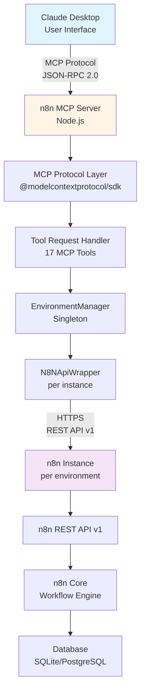

# API Architecture Overview

Comprehensive system architecture, components, and integration patterns for the n8n MCP Workflow Builder.

---

## System Architecture

### High-Level Architecture



**Communication Flow:**

```
User Request (Claude Desktop)
    ↓ MCP Protocol (stdio/HTTP)
    ↓ JSON-RPC 2.0
MCP Server (Node.js)
    ↓ Tool Routing
EnvironmentManager (Multi-Instance Router)
    ↓ Instance Selection
N8NApiWrapper (HTTP Client)
    ↓ REST API Call
n8n Instance (Workflow Engine)
    ↓ Response
Back to User
```

---

## Component Details

### 1. MCP Protocol Layer

**Technology:** `@modelcontextprotocol/sdk` v0.5.0+

**Purpose:** Standardized protocol enabling Claude Desktop to communicate with external services

**Transport Options:**

- **stdio:** Standard input/output for local processes (default)
- **HTTP:** JSON-RPC over HTTP for remote servers (port 3456 by default)

**Message Format:** JSON-RPC 2.0

```json
// Request Example
{
  "jsonrpc": "2.0",
  "id": 1,
  "method": "tools/call",
  "params": {
    "name": "list_workflows",
    "arguments": {
      "instance": "production",
      "active": true
    }
  }
}

// Response Example
{
  "jsonrpc": "2.0",
  "id": 1,
  "result": {
    "content": [{
      "type": "text",
      "text": "{\"data\": [...workflow data...], \"nextCursor\": \"...\"}"
    }]
  }
}
```

**Key Features:**

- **Tool Discovery:** List available MCP tools dynamically
- **Resource Provisioning:** Static (`n8n://workflows`) and dynamic (`n8n://workflows/{id}`) resources
- **Prompt Templates:** 5 workflow generation templates
- **Notification Support:** v0.9.0+ includes notification handler for `notifications/initialized`

---

### 2. Tool Request Handler

**File:** `src/index.ts`

**Responsibilities:**

- Register all 23 MCP tools (17 operational + 6 credential tools)
- Parse and validate tool parameters using JSON schema
- Route requests to appropriate API handlers
- Transform responses to MCP protocol format
- Handle multi-instance parameter routing

**Tool Categories:**

```typescript
// Workflow Tools (8 operations)
const workflowTools = [
  'list_workflows',      // List with filtering & pagination
  'get_workflow',        // Retrieve complete workflow
  'create_workflow',     // Create new workflow
  'update_workflow',     // Modify existing workflow
  'delete_workflow',     // Permanently remove workflow
  'activate_workflow',   // Enable workflow execution
  'deactivate_workflow', // Disable workflow execution
  'execute_workflow'     // Manual execution (limited)
];

// Execution Tools (4 operations)
const executionTools = [
  'list_executions',  // List execution history
  'get_execution',    // Get detailed execution data
  'delete_execution', // Remove execution records
  'retry_execution'   // Retry failed executions
];

// Credential Tools (6 operations)
const credentialTools = [
  'list_credentials',      // Security guidance (blocked by n8n)
  'get_credential',        // Security guidance (blocked by n8n)
  'create_credential',     // Schema-driven creation
  'update_credential',     // Immutability guidance
  'delete_credential',     // Permanent removal
  'get_credential_schema'  // Get JSON schema
];

// Tag Tools (5 operations)
const tagTools = [
  'create_tag',  // Create workflow tags
  'get_tags',    // List all tags
  'get_tag',     // Get specific tag
  'update_tag',  // Rename tag
  'delete_tag'   // Remove tag
];
```

**Request Processing Flow:**

```
1. Receive JSON-RPC request from Claude Desktop
2. Parse tool name and arguments from request
3. Extract optional instance parameter
4. Validate required parameters against JSON schema
5. Route to EnvironmentManager with instance identifier
6. Execute API call through N8NApiWrapper
7. Transform response data to MCP format
8. Return JSON-RPC response to client
```

---

### 3. EnvironmentManager (Multi-Instance Router)

**File:** `src/services/environmentManager.ts`

**Pattern:** Singleton

**Purpose:** Centralized management and routing for multiple n8n instances (production, staging, development, etc.)

**Core API:**

```typescript
class EnvironmentManager {
  private static instance: EnvironmentManager;
  private apiInstances: Map<string, N8NApiWrapper>;
  private config: MultiInstanceConfig;

  // Singleton access
  public static getInstance(): EnvironmentManager;

  // Get or create API wrapper for environment
  public getApi(instanceName?: string): N8NApiWrapper;

  // List available environments
  public listEnvironments(): string[];

  // Get default environment name
  public getDefaultEnvironment(): string;

  // Validate environment exists
  public validateEnvironment(name: string): void;

  // Clear cached API instances
  public clearCache(instanceName?: string): void;
}
```

**Caching Strategy:**

- **API Instance Caching:** One N8NApiWrapper per environment, reused across requests
- **Connection Pooling:** Axios instances with HTTP keep-alive connections
- **Performance Impact:** ~100x faster than creating new instances per request
- **Cache Invalidation:** Manual via `clearCache()` or automatic on configuration reload

**Instance Resolution Logic:**

```
Tool Request Received
    ↓
Check "instance" parameter
    ├─ Provided? → Validate instance exists in .config.json
    │              ├─ Valid? → Use specified instance
    │              └─ Invalid? → Throw error with available instances list
    └─ Not provided? → Use defaultEnv from .config.json
```

---

### 4. N8NApiWrapper (n8n REST API Client)

**File:** `src/services/n8nApiWrapper.ts`

**Purpose:** Abstraction layer for n8n REST API v1 with connection management

**Architecture:**

```typescript
class N8NApiWrapper {
  private baseURL: string;        // e.g., https://n8n.cloud/api/v1
  private apiKey: string;          // X-N8N-API-KEY header value
  private axiosInstance: AxiosInstance;

  // Workflow operations (8 methods)
  async listWorkflows(params: ListWorkflowsParams): Promise<WorkflowListResponse>;
  async getWorkflow(id: string): Promise<WorkflowDefinition>;
  async createWorkflow(data: CreateWorkflowParams): Promise<WorkflowDefinition>;
  async updateWorkflow(id: string, data: UpdateWorkflowParams): Promise<WorkflowDefinition>;
  async deleteWorkflow(id: string): Promise<void>;
  async activateWorkflow(id: string): Promise<WorkflowDefinition>;
  async deactivateWorkflow(id: string): Promise<WorkflowDefinition>;

  // Execution operations (4 methods)
  async listExecutions(params: ListExecutionsParams): Promise<ExecutionListResponse>;
  async getExecution(id: number, includeData?: boolean): Promise<Execution>;
  async deleteExecution(id: number): Promise<void>;
  async retryExecution(id: number): Promise<Execution>;

  // Credential operations (3 methods)
  async getCredentialSchema(type: string): Promise<CredentialSchema>;
  async createCredential(data: CreateCredentialParams): Promise<Credential>;
  async deleteCredential(id: string): Promise<void>;

  // Tag operations (5 methods)
  async createTag(data: CreateTagParams): Promise<Tag>;
  async getTags(params?: GetTagsParams): Promise<TagListResponse>;
  async getTag(id: string): Promise<Tag>;
  async updateTag(id: string, data: UpdateTagParams): Promise<Tag>;
  async deleteTag(id: string): Promise<void>;
}
```

**HTTP Configuration:**

```typescript
{
  baseURL: "https://n8n.example.com/api/v1",
  headers: {
    "X-N8N-API-KEY": "n8n_api_...",
    "Content-Type": "application/json",
    "Accept": "application/json"
  },
  timeout: 30000,  // 30 seconds
  maxRedirects: 5,
  validateStatus: (status) => status < 500  // Don't throw on 4xx
}
```

**Error Handling:**

- Axios errors enriched with n8n API response data
- Status codes preserved and passed to MCP layer
- Detailed error messages for debugging
- Network errors (ECONNREFUSED, ETIMEDOUT) handled separately

---

### 5. Configuration Management

**Files:**

- `src/config/configLoader.ts` - Configuration loading and validation
- `.config.json` - Multi-instance configuration (primary)
- `.env` - Single-instance fallback

**Configuration Priority:**

```
1. Runtime environment variables (highest)
   ↓
2. .config.json (multi-instance)
   ↓
3. .env file (single-instance legacy)
```

**Multi-Instance Configuration Format:**

```json
{
  "environments": {
    "production": {
      "n8n_host": "https://n8n-prod.example.com",
      "n8n_api_key": "n8n_api_prod_key_here"
    },
    "staging": {
      "n8n_host": "https://n8n-staging.example.com",
      "n8n_api_key": "n8n_api_staging_key_here"
    },
    "development": {
      "n8n_host": "http://localhost:5678",
      "n8n_api_key": "n8n_api_dev_key_here"
    }
  },
  "defaultEnv": "development"
}
```

**ConfigLoader Responsibilities:**

- Load and parse `.config.json` or `.env`
- Validate required fields (n8n_host, n8n_api_key)
- Normalize URLs (remove trailing `/api/v1/`)
- Provide singleton access to configuration
- Support environment variable overrides

**URL Normalization:**

```typescript
// Input: https://n8n.cloud/api/v1/
// Output: https://n8n.cloud/api/v1

// Server automatically appends /api/v1 during API calls
```

---

## Data Flow Examples

### Example 1: List Workflows (Multi-Instance)

```
1. User Request (Claude Desktop):
   "List active workflows in production"

2. Claude generates MCP request:
   {
     "method": "tools/call",
     "params": {
       "name": "list_workflows",
       "arguments": {
         "instance": "production",
         "active": true,
         "limit": 50
       }
     }
   }

3. MCP Server Processing:
   ├─ Tool Handler receives request
   ├─ Extracts: instance="production", active=true, limit=50
   ├─ Routes to EnvironmentManager
   └─ Validates "production" exists

4. EnvironmentManager:
   ├─ Checks cache for production API instance
   ├─ Returns cached N8NApiWrapper(production)
   └─ Calls listWorkflows({ active: true, limit: 50 })

5. N8NApiWrapper:
   ├─ Builds HTTP request:
   │  GET https://n8n-prod.example.com/api/v1/workflows?active=true&limit=50
   │  Headers: { "X-N8N-API-KEY": "prod_key" }
   └─ Sends to production n8n instance

6. n8n Instance (Production):
   ├─ Authenticates API key
   ├─ Queries database for active workflows
   ├─ Returns JSON response with metadata
   └─ Response size: ~5-50KB (metadata only, no full node data)

7. Response Flow:
   n8n API → N8NApiWrapper → EnvironmentManager → Tool Handler → MCP Protocol → Claude

8. Claude presents to user:
   "Found 12 active workflows in production:
   1. Email Campaign (15 nodes, last updated 2 days ago)
   2. Slack Notifications (7 nodes, last updated 5 hours ago)
   3. Data Sync (23 nodes, last updated 1 week ago)
   ..."
```

**Performance Metrics:**

- **Total Time:** 100-200ms
  - MCP Protocol overhead: ~5ms
  - Instance routing: ~0ms (cached)
  - HTTP request: 50-150ms
  - Response formatting: ~5ms

### Example 2: Create Workflow (Multi-Instance Deployment)

```
Development → Staging → Production Pipeline

1. Create in Development:
   User: "Create customer onboarding workflow in development"

   MCP Request → Tool Handler → EnvironmentManager
   → N8NApiWrapper(development) → POST /api/v1/workflows
   → n8n(development)

   Response: { id: "101", name: "Customer Onboarding", ... }

2. Test in Development:
   User: "Activate workflow 101 in development and test it"

   → activate_workflow(101, instance="development")
   → Manual testing via n8n UI or webhook calls

3. Promote to Staging:
   User: "It works! Create the same workflow in staging"

   → get_workflow(101, instance="development")
   → create_workflow({...workflow_data}, instance="staging")

   Response: { id: "201", ... } (different ID in staging)

4. QA Testing in Staging:
   → list_executions(workflowId=201, instance="staging")
   → Verify execution success rate, performance

5. Deploy to Production:
   User: "Staging tests passed! Deploy to production but keep inactive"

   → create_workflow({...workflow_data}, instance="production", active=false)

   Response: { id: "301", active: false }

   User: "Looks good, activate it"
   → activate_workflow(301, instance="production")
```

**Cross-Instance Deployment Benefits:**

- Separate API keys per environment
- Isolated testing and validation
- Gradual rollout with confidence
- Easy rollback (deactivate in production)

---

## Performance Characteristics

### Connection Pooling Impact

**Without Caching (Initial Implementation):**

```
10 API calls to same instance:
  - Creates 10 separate axios instances
  - Each instance: ~2ms creation overhead
  - Total overhead: ~20ms
  - HTTP connections: 10 new connections
```

**With Caching (Current v0.8.0+):**

```
10 API calls to same instance:
  - Reuses single cached axios instance
  - First call: ~2ms overhead
  - Subsequent calls: ~0ms overhead
  - Total overhead: ~2ms
  - HTTP connections: 1 (with keep-alive)
  - Improvement: ~90% faster
```

### API Call Latency (Typical)

| Operation | Response Time | Factors |
|-----------|--------------|---------|
| list_workflows (metadata) | 50-150ms | Workflow count, n8n load |
| get_workflow (full) | 100-300ms | Workflow complexity, node count |
| create_workflow | 150-400ms | Node count, validation time |
| update_workflow | 100-350ms | Changes size, validation |
| list_executions | 100-250ms | Execution count, filters |
| get_execution (with data) | 200-500ms | Execution data size |
| activate_workflow | 100-200ms | Trigger validation |
| retry_execution | 150-300ms | Original execution size |

**Latency Factors:**

- n8n instance load and performance
- Network latency (local vs. cloud)
- Workflow/execution data size
- Database query performance
- Number of nodes in workflow

### Optimization Strategies

**1. Metadata-Only Listing (Epic 2 Optimization):**

```typescript
// list_workflows returns streamlined metadata
{
  id: "123",
  name: "Email Campaign",
  active: true,
  nodes: 15,  // Count only, not full node definitions
  tags: [...],
  createdAt: "...",
  updatedAt: "..."
}

// 90%+ data reduction compared to full workflow objects
// Prevents Claude Desktop crashes with large workflow lists
```

**2. Cursor-Based Pagination:**

```typescript
// First page
const page1 = await list({ limit: 100 });
// Returns: { data: [...], nextCursor: "eyJ..." }

// Second page
const page2 = await list({ limit: 100, cursor: page1.nextCursor });
// Stable pagination even if data changes
```

**3. Conditional Data Loading:**

```typescript
// List executions without data (fast)
const executions = await listExecutions({
  workflowId: "123",
  includeData: false  // Metadata only
});

// Get specific execution with full data (slower but detailed)
const execution = await getExecution({
  id: 9876,
  includeData: true  // Full execution data for debugging
});
```

---

## Error Handling Strategy

### Error Type Hierarchy

```typescript
// Configuration Errors
class ConfigurationError extends Error {
  code: 'CONFIGURATION_ERROR';
  message: 'Missing required configuration: n8n_api_key';
  // Thrown during server startup
}

// Authentication Errors
class AuthenticationError extends Error {
  code: 'AUTHENTICATION_ERROR';
  httpStatus: 401;
  message: 'Invalid API key for instance "production"';
  // Invalid or expired API key
}

// Instance Resolution Errors
class InstanceError extends Error {
  code: 'INSTANCE_NOT_FOUND';
  availableInstances: string[];
  message: 'Instance "prod" not found. Available: production, staging, development';
  // Requested instance doesn't exist in config
}

// n8n API Errors
class ApiError extends Error {
  code: 'API_ERROR';
  httpStatus: number;
  apiResponse: any;
  message: 'Workflow validation failed: missing trigger node';
  // n8n API returned error response
}

// Network Errors
class NetworkError extends Error {
  code: 'NETWORK_ERROR' | 'TIMEOUT' | 'ECONNREFUSED';
  message: 'Connection timeout after 30000ms';
  // Network connectivity issues
}
```

### Error Propagation Flow

```
n8n API Error (e.g., 400 Bad Request)
    ↓
N8NApiWrapper catches axios error
    ↓ Enriches with context
{ status: 400, data: {...}, instance: "production" }
    ↓
EnvironmentManager adds instance context
    ↓
{ error: "...", instance: "production", available: [...] }
    ↓
Tool Handler formats for MCP protocol
    ↓
JSON-RPC error response
{
  "jsonrpc": "2.0",
  "error": {
    "code": -32000,
    "message": "API error: Workflow validation failed"
  }
}
    ↓
Claude Desktop displays user-friendly error
"I couldn't create the workflow because it's missing a trigger node."
```

### Error Recovery Patterns

**1. Instance Validation:**

```typescript
try {
  const api = envManager.getApi(instanceName);
} catch (error) {
  if (error.code === 'INSTANCE_NOT_FOUND') {
    const available = envManager.listEnvironments();
    throw new Error(
      `Instance "${instanceName}" not found. ` +
      `Available instances: ${available.join(', ')}`
    );
  }
}
```

**2. Automatic Trigger Addition (Epic 1 Fix):**

```typescript
async activateWorkflow(id: string): Promise<Workflow> {
  const workflow = await this.getWorkflow(id);

  // Check if workflow has valid trigger
  const hasTrigger = workflow.nodes.some(node =>
    node.type === 'n8n-nodes-base.scheduleTrigger' ||
    node.type === 'n8n-nodes-base.webhook'
  );

  if (!hasTrigger) {
    // Add schedule trigger automatically
    workflow.nodes.push({
      name: 'Schedule Trigger',
      type: 'n8n-nodes-base.scheduleTrigger',
      // ... trigger configuration
    });

    await this.updateWorkflow(id, workflow);
  }

  // Now activate
  return await this.activateWorkflow(id);
}
```

---

## Security Architecture

### API Key Management

**Storage:**

```
.config.json (multi-instance)
├─ Excluded from version control (.gitignore)
├─ File permissions: 600 (user read/write only)
└─ Contains API keys per environment

Environment Variables (runtime override)
├─ N8N_API_KEY for single-instance
└─ Higher priority than .config.json
```

**Transmission Security:**

- **HTTPS Only:** All API calls use HTTPS (enforced)
- **Header-Based:** API key sent in `X-N8N-API-KEY` header
- **Never in URL:** API keys never in query parameters or URL path
- **No Logging:** API keys excluded from error messages and logs

**Rotation Procedure:**

```bash
# 1. Generate new API key in n8n UI
#    Settings → API → Generate API Key

# 2. Update configuration
# .config.json:
{
  "environments": {
    "production": {
      "n8n_api_key": "NEW_KEY_HERE"
    }
  }
}

# 3. Restart MCP server
npm start

# 4. Verify with health check
curl http://localhost:3456/health
```

### Credential Isolation (Epic 2 Security Model)

**n8n Security Architecture:**

- Credentials encrypted in n8n database using AES-256
- REST API blocks LIST and GET operations
- Credentials only accessible through n8n UI
- MCP server cannot retrieve credential values

**MCP Server Credential Handling:**

```typescript
// ❌ Blocked by n8n API
list_credentials()  // Returns security guidance, not credentials

// ❌ Blocked by n8n API
get_credential(id)  // Returns security guidance, not credential data

// ✅ Allowed: Schema-driven creation
get_credential_schema(type)  // Returns JSON schema
create_credential({ name, type, data })  // Creates encrypted credential

// ✅ Allowed: Reference by ID
workflow.nodes.push({
  credentials: {
    httpBasicAuth: {
      id: "cred_123",  // Reference only, no credential data
      name: "API Credentials"
    }
  }
});
```

**Benefits:**

- Credentials never exposed through MCP protocol
- Reduced attack surface for credential theft
- Centralized credential management in n8n UI
- Audit trail in n8n (creation, usage, deletion)

---

## Versioning & Compatibility

### MCP Server Version

**Current Version:** 0.9.1

**Versioning Scheme:** Semantic Versioning (semver)

- **Major (X.0.0):** Breaking API changes, incompatible protocol changes
- **Minor (0.X.0):** New features, backward-compatible enhancements
- **Patch (0.0.X):** Bug fixes, performance improvements

**Version Check:**

```bash
# NPM package
npx @kernel.salacoste/n8n-workflow-builder --version
# Output: 0.9.1

# Programmatic check
curl http://localhost:3456/health
# Response: { "status": "ok", "version": "0.9.1", "n8nVersion": "1.82.3" }
```

**Version History (Recent):**

- **v0.9.1** - Package size optimization, documentation improvements
- **v0.9.0** - Notification handler support, fixes "Method 'notifications/initialized' not found"
- **v0.8.0** - Multi-instance architecture, list_workflows optimization
- **v0.7.2** - Set node parameter fixes, port conflict handling

### n8n API Compatibility

**Supported API Version:** n8n REST API v1

**Tested With:** n8n v1.82.3

**Compatibility Matrix:**

| n8n Version | API v1 Support | MCP Server Compatibility | Notes |
|-------------|----------------|--------------------------|-------|
| 1.82.3 | ✅ Stable | ✅ Fully tested | Recommended |
| 1.80.x - 1.82.x | ✅ Stable | ✅ Compatible | Minor differences |
| 1.70.x - 1.79.x | ✅ Stable | ⚠️ Mostly compatible | Some features may differ |
| < 1.70.0 | ⚠️ Older | ❌ Not tested | Use at own risk |

**Known n8n API Limitations:**

1. **Manual Trigger Limitation (Epic 1):**
   - Workflows with only `manualTrigger` cannot be executed via REST API
   - Workaround: Use scheduleTrigger or webhook

2. **Credential Security (Epic 2):**
   - LIST and GET operations blocked for credentials
   - Schema-driven creation required

3. **Tag Update Conflicts (Epic 2):**
   - Tag updates may return 409 Conflict
   - Workaround: DELETE + CREATE pattern

**Forward Compatibility:**

- MCP server designed for minor n8n version updates
- Graceful degradation for unsupported features
- Version detection via `/api/v1/` response headers

---

## Next Steps

Continue exploring the API reference documentation:

- **[Workflows API Reference](workflows-api.md)** - Complete reference for all 8 workflow operations
- **[Executions API Reference](executions-api.md)** - Execution management and debugging
- **[Credentials API Reference](credentials-api.md)** - Schema-driven credential creation
- **[Tags API Reference](tags-api.md)** - Workflow organization with tags
- **[Resources & Prompts](resources-prompts.md)** - MCP resources and workflow templates

---

**Document Version:** 1.0
**Last Updated:** January 2025
**MCP Server Version:** 0.9.1
**n8n API Version:** v1 (tested with n8n 1.82.3)
