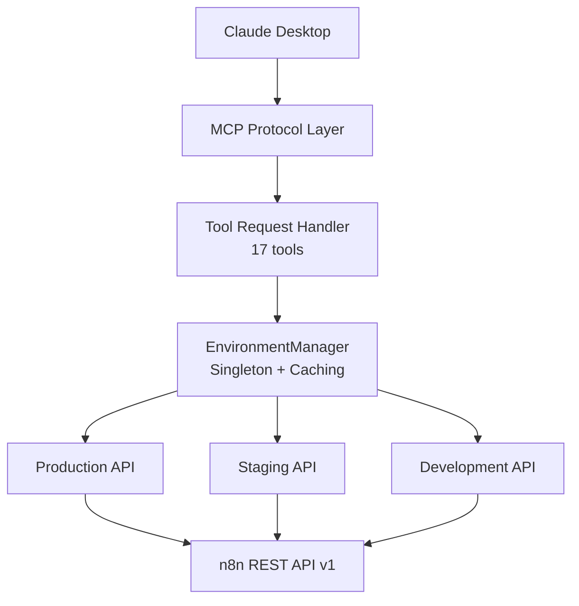

# Story 8.2: Documentation Site Structure & Content Organization

**Epic:** Epic 8 - Deployment & GitHub Pages Publishing
**Story Points:** 8
**Priority:** High
**Status:** Ready for Implementation
**Estimated Page Count:** 15-20 pages

---

## User Story

**As a** documentation contributor
**I want** well-organized documentation site structure with clear navigation
**So that** users can easily find information and understand the system

---

## Story Description

### Current System

With Story 8.1 completed:
- ✅ MkDocs Material configured
- ✅ GitHub Actions workflow ready
- ✅ GitHub Pages enabled
- ❌ No actual documentation content migrated
- ❌ No homepage or landing pages
- ❌ No asset organization
- ❌ No cross-linking strategy

### Enhancement

Create complete documentation site structure:
- **Content Migration:** Transform story files (200+ pages) into user-facing documentation
- **Homepage Design:** Professional landing page with quick links
- **Navigation Hierarchy:** Logical organization with progressive disclosure
- **Asset Management:** Organized images, diagrams, code samples
- **Cross-Linking:** Internal references and breadcrumb navigation
- **Search Optimization:** Keywords, metadata, and search hints

---

## Acceptance Criteria

### AC1: Homepage & Landing Pages
**Given** users visiting documentation site
**When** they land on homepage
**Then** they should see clear navigation and quick start paths:

#### 1.1 Homepage Structure

**File:** `docs/index.md`

```markdown
# n8n MCP Workflow Builder

AI-powered n8n workflow management via Model Context Protocol

---

## What is n8n MCP Workflow Builder?

An MCP (Model Context Protocol) server that enables AI assistants like Claude to create, manage, and monitor n8n workflows through natural language interactions.

**Key Features:**
- 🤖 **AI-Native**: Natural language workflow creation via Claude Desktop
- 🔄 **Multi-Instance**: Manage multiple n8n environments (production, staging, development)
- 🛠️ **17 MCP Tools**: Complete workflow, execution, credential, and tag management
- 📊 **4 Resources**: Dynamic workflow and execution data access
- 🎯 **5 Prompts**: Pre-built workflow templates for common patterns
- 🔒 **Secure**: Schema-driven credential management with encryption

---

## Quick Start

<div class="grid cards" markdown>

-   :material-clock-fast:{ .lg .middle } __Get Started in 10 Minutes__

    ---

    Install via npm and configure your first n8n instance

    [:octicons-arrow-right-24: Installation Guide](../../getting-started/installation/npm-installation.md)

-   :material-book-open-variant:{ .lg .middle } __Learn the Basics__

    ---

    Create your first workflow with Claude Desktop

    [:octicons-arrow-right-24: Quick Start Tutorial](../../getting-started/quick-start/first-workflow.md)

-   :material-api:{ .lg .middle } __API Reference__

    ---

    Complete API documentation for all 17 tools

    [:octicons-arrow-right-24: API Docs](../../api/overview.md)

-   :material-help-circle:{ .lg .middle } __Examples & Tutorials__

    ---

    Real-world workflow examples and integration guides

    [:octicons-arrow-right-24: View Examples](../../examples/basic/webhook-workflow.md)

</div>

---

## Architecture Overview



---

## Features at a Glance

### Workflow Management
- Create, read, update, delete workflows
- Activate/deactivate workflows
- Execute workflows manually
- Full validation and error handling

### Execution Monitoring
- List execution history with filtering
- Detailed execution data and logs
- Retry failed executions
- Delete execution records

### Credential Security
- Schema-driven credential creation
- Secure credential storage (n8n encryption)
- Support for 100+ credential types
- OAuth2, API keys, database connections

### Multi-Instance Support
- Manage multiple n8n environments
- Environment-specific configurations
- Instance routing in all tools
- Connection pooling and caching

---

## Use Cases

### 1. AI-Powered Automation Design
"Create a Slack notification workflow that triggers when new orders arrive"

Claude creates a complete workflow with webhook trigger, data validation, and Slack integration.

### 2. Multi-Environment Management
"List all active workflows in production, then create a copy in staging"

Seamlessly work across environments with instance-aware commands.

### 3. Workflow Debugging
"Show me the last 10 failed executions and their error messages"

Quickly identify and troubleshoot workflow issues with execution analysis.

### 4. Integration Development
"Build a workflow that syncs Google Sheets data to PostgreSQL every hour"

Leverage 200+ n8n integrations through natural language.

---

## Next Steps

<div class="grid" markdown>

- [Installation Guide →](../../getting-started/installation/npm-installation.md)
- [Configuration Setup →](../../getting-started/installation/configuration.md)
- [First Workflow →](../../getting-started/quick-start/first-workflow.md)
- [API Reference →](../../api/overview.md)

</div>

---

## Version Information

**Current Version:** 0.9.0
**Tested with:** n8n version 1.82.3
**Protocol:** JSON-RPC 2.0 over stdio (MCP)

[View Changelog](../../about/changelog.md) | [GitHub Repository](https://github.com/your-org/mcp-n8n-workflow-builder) | [Report Issues](https://github.com/your-org/mcp-n8n-workflow-builder/issues)
```

#### 1.2 Getting Started Landing Page

**File:** `docs/getting-started/index.md`

```markdown
# Getting Started

Welcome to the n8n MCP Workflow Builder! This guide will help you set up and start using the MCP server with Claude Desktop.

---

## Prerequisites

Before you begin, ensure you have:

- ✅ **Node.js** 18+ installed
- ✅ **n8n** instance running (cloud or self-hosted)
- ✅ **n8n API key** with appropriate permissions
- ✅ **Claude Desktop** installed (for MCP integration)

Don't have n8n yet? [Get started with n8n →](https://n8n.io/get-started/)

---

## Installation Path

Choose your installation method:

### Option 1: NPM Installation (Recommended)

Fast and simple installation via npm registry.

[:octicons-arrow-right-24: NPM Installation Guide](installation/npm-installation.md)

**Time:** ~5 minutes

### Option 2: Manual Installation

Build from source for development or customization.

[:octicons-arrow-right-24: Manual Installation Guide](installation/manual-installation.md)

**Time:** ~10 minutes

---

## Configuration

After installation, configure your n8n connection:

### Single Instance Setup

Perfect for getting started with one n8n environment.

[:octicons-arrow-right-24: Single Instance Configuration](installation/configuration.md#single-instance)

### Multi-Instance Setup

Manage multiple environments (production, staging, development).

[:octicons-arrow-right-24: Multi-Instance Configuration](installation/configuration.md#multi-instance)

---

## Quick Start Tutorial

Once configured, follow our quick start guide:

1. [Claude Desktop Integration](quick-start/claude-desktop.md) - Connect MCP server to Claude
2. [Create Your First Workflow](quick-start/first-workflow.md) - Build a simple workflow
3. [Verification & Testing](quick-start/verification.md) - Validate your setup

**Total Time:** ~15 minutes

---

## Learning Path

### Beginners
1. Installation → Configuration → First Workflow → Examples
2. Focus on: Basic workflows, simple integrations, common patterns

### Intermediate Users
1. Multi-Instance Setup → Advanced Patterns → API Reference
2. Focus on: Complex workflows, error handling, execution monitoring

### Advanced Users
1. Multi-Instance → Deployment → CI/CD → Custom Development
2. Focus on: Architecture, performance optimization, security

---

## Next Steps

<div class="grid" markdown>

- [Install via NPM →](installation/npm-installation.md)
- [Configuration Guide →](installation/configuration.md)
- [First Workflow Tutorial →](quick-start/first-workflow.md)

</div>
```

---

### AC2: Content Migration from Story Files
**Given** 200+ pages of documentation in story files
**When** migrating to user-facing documentation
**Then** content should be reorganized and optimized:

#### 2.1 Migration Strategy

**Content Transformation Rules:**

1. **Epic 3 Stories → Getting Started**
   - Story 3.1 (NPM Installation) → `docs/getting-started/installation/npm-installation.md`
   - Story 3.2 (Manual Installation) → `docs/getting-started/installation/manual-installation.md`
   - Story 3.3 (Configuration) → `docs/getting-started/installation/configuration.md`
   - Story 3.4 (Claude Desktop) → `docs/getting-started/quick-start/claude-desktop.md`
   - Story 3.5 (First Workflow) → `docs/getting-started/quick-start/first-workflow.md`
   - Story 3.6 (Verification) → `docs/getting-started/quick-start/verification.md`

2. **Epic 4 Stories → Features & Tools**
   - Story 4.1 (Workflows) → `docs/features/workflows-management.md`
   - Story 4.2 (Executions) → `docs/features/executions-management.md`
   - Story 4.3 (Tags) → `docs/features/tags-management.md`
   - Story 4.4 (Credentials) → `docs/features/credentials-security.md`
   - Story 4.5 (Resources) → `docs/features/mcp-resources.md`
   - Story 4.6 (Error Handling) → `docs/features/error-handling.md`

3. **Epic 5 Stories → Multi-Instance**
   - Story 5.1 (Configuration) → `docs/multi-instance/configuration.md`
   - Story 5.2 (EnvironmentManager) → `docs/multi-instance/environment-manager.md`
   - Story 5.3 (Routing) → `docs/multi-instance/instance-routing.md`
   - Story 5.4 (Testing) → `docs/multi-instance/testing.md`
   - Story 5.5 (Documentation) → `docs/multi-instance/examples.md`
   - Create `docs/multi-instance/overview.md` - High-level multi-instance introduction

4. **Epic 6 Stories → Examples & Tutorials**
   - Story 6.1 (Workflows) → `docs/examples/basic/webhook-workflow.md`, `integrations.md`, `advanced-patterns.md`
   - Story 6.2 (Integrations) → `docs/examples/integrations/slack.md`, `email.md`, `google-sheets.md`, `databases.md`
   - Story 6.3 (Claude Desktop) → `docs/examples/claude-desktop-patterns.md`
   - Story 6.4 (Troubleshooting) → `docs/troubleshooting/error-reference.md`

5. **Epic 7 Stories → API Reference**
   - Story 7.1 (Overview) → `docs/api/overview.md`, `architecture.md`
   - Story 7.2 (Workflows API) → `docs/api/workflows-api.md`
   - Story 7.3 (Executions API) → `docs/api/executions-api.md`
   - Story 7.4 (Credentials API) → `docs/api/credentials-api.md`
   - Story 7.5 (Tags API) → `docs/api/tags-api.md`
   - Story 7.6 (Resources) → `docs/api/resources-prompts.md`

#### 2.2 Content Transformation Examples

**Before (Story Format):**
```markdown
# Story 4.1: Workflows Management Tools Documentation

**Epic:** Epic 4 - Core Features & Tools Reference
**Story Points:** 8
**Priority:** High

## User Story
**As a** developer using workflow management tools...

## Acceptance Criteria
### AC1: list_workflows Documentation
**Given** users listing workflows...
```

**After (User Documentation):**
```markdown
# Workflow Management

Complete guide to creating, managing, and monitoring n8n workflows through the MCP server.

---

## Overview

The MCP server provides 8 workflow management tools for complete workflow lifecycle management:

- **Creation:** `create_workflow` - Build workflows with validation
- **Reading:** `list_workflows`, `get_workflow` - Retrieve workflow information
- **Updates:** `update_workflow` - Modify existing workflows
- **Deletion:** `delete_workflow` - Remove workflows
- **Activation:** `activate_workflow`, `deactivate_workflow` - Control workflow state
- **Execution:** `execute_workflow` - Manual workflow execution

---

## List Workflows

Retrieve workflow metadata with filtering and pagination.

### Parameters

| Parameter | Type | Required | Description |
|-----------|------|----------|-------------|
| instance | string | No | Instance identifier (uses default if not provided) |
| active | boolean | No | Filter by active status |
| tags | string[] | No | Filter by tag names |
| limit | number | No | Max workflows to return (1-250, default: 100) |
| cursor | string | No | Pagination cursor |

### Example Usage

**Claude Desktop:**
```
You: "List all active workflows in production"

Claude: [Calls list_workflows with instance="production", active=true]

✅ Found 15 active workflows in production:
1. Customer Welcome Email (ID: 123, Tags: [email, onboarding])
2. Daily Sales Report (ID: 124, Tags: [reporting, sales])
...
```
```

#### 2.3 Migration Checklist

**For Each Migrated Page:**

- [ ] Remove story metadata (story points, epic references, status)
- [ ] Convert acceptance criteria to user-facing sections
- [ ] Simplify technical implementation to essential concepts
- [ ] Add practical examples and use cases
- [ ] Include Claude Desktop conversation examples
- [ ] Add cross-references to related pages
- [ ] Optimize for search (keywords, headings)
- [ ] Add admonitions (notes, warnings, tips)
- [ ] Include diagrams where appropriate
- [ ] Validate all code examples

---

### AC3: Navigation Hierarchy & Information Architecture
**Given** users navigating documentation
**When** browsing site structure
**Then** information should be logically organized:

#### 3.1 Navigation Structure

**Primary Navigation (Tabs):**

```yaml
nav:
  - Home: index.md

  - Getting Started:
      - Overview: getting-started/index.md
      - Installation:
          - NPM Installation: getting-started/installation/npm-installation.md
          - Manual Installation: getting-started/installation/manual-installation.md
          - Configuration Setup: getting-started/installation/configuration.md
      - Quick Start:
          - Claude Desktop Integration: getting-started/quick-start/claude-desktop.md
          - First Workflow: getting-started/quick-start/first-workflow.md
          - Verification & Testing: getting-started/quick-start/verification.md

  - Features & Tools:
      - Overview: features/index.md
      - Workflow Management: features/workflows-management.md
      - Execution Management: features/executions-management.md
      - Tag Management: features/tags-management.md
      - Credential Security: features/credentials-security.md
      - MCP Resources: features/mcp-resources.md
      - Error Handling: features/error-handling.md

  - Multi-Instance:
      - Overview: multi-instance/overview.md
      - Configuration: multi-instance/configuration.md
      - Environment Manager: multi-instance/environment-manager.md
      - Instance Routing: multi-instance/instance-routing.md
      - Testing: multi-instance/testing.md
      - Examples: multi-instance/examples.md

  - Examples & Tutorials:
      - Overview: examples/index.md
      - Workflow Examples:
          - Basic Patterns: examples/basic/webhook-workflow.md
          - Integration Examples: examples/workflows/integrations.md
          - Advanced Patterns: examples/workflows/advanced-patterns.md
      - Integrations:
          - Slack: examples/integrations/slack.md
          - Email: examples/integrations/email.md
          - Google Sheets: examples/integrations/google-sheets.md
          - Databases: examples/integrations/databases.md
      - Usage Patterns: examples/claude-desktop-patterns.md
      - Troubleshooting: troubleshooting/error-reference.md

  - API Reference:
      - Overview: api/overview.md
      - Architecture: api/architecture.md
      - Workflows API: api/workflows-api.md
      - Executions API: api/executions-api.md
      - Credentials API: api/credentials-api.md
      - Tags API: api/tags-api.md
      - Resources & Prompts: api/resources-prompts.md

  - Deployment:
      - Quick Start: deployment/quick-start.md
      - Docker: deployment/docker.md
      - Kubernetes: deployment/kubernetes.md
      - Serverless: deployment/serverless.md

  - About:
      - Changelog: about/changelog.md
      - Contributing: about/contributing.md
      - License: about/license.md
```

#### 3.2 Information Architecture Principles

**Progressive Disclosure:**
- **Level 1 (Tabs):** High-level categories (7 sections)
- **Level 2 (Sections):** Feature groupings or topics
- **Level 3 (Pages):** Detailed documentation
- **Level 4 (Headings):** Specific concepts within pages

**User Journey Mapping:**


**Content Depth Guidelines:**

| Section | Target Audience | Depth | Page Count |
|---------|----------------|-------|------------|
| Getting Started | Beginners | Tutorial | 6 pages |
| Features & Tools | Intermediate | Reference + Examples | 7 pages |
| Multi-Instance | Intermediate/Advanced | Configuration + Patterns | 6 pages |
| Examples | All Levels | Practical Tutorials | 10 pages |
| API Reference | Developers | Complete Technical Specs | 7 pages |
| Deployment | DevOps/Advanced | Production Guides | 4 pages |

---

### AC4: Asset Organization & Management
**Given** images, diagrams, and code samples
**When** organizing site assets
**Then** they should be structured and optimized:

#### 4.1 Asset Directory Structure

```
docs/
├── assets/
│   ├── images/
│   │   ├── logo.png                    # Site logo (256x256)
│   │   ├── favicon.png                 # Favicon (32x32)
│   │   ├── screenshots/
│   │   │   ├── claude-desktop-setup.png
│   │   │   ├── workflow-example.png
│   │   │   └── multi-instance-config.png
│   │   ├── diagrams/
│   │   │   ├── architecture-overview.svg
│   │   │   ├── multi-instance-routing.svg
│   │   │   └── execution-flow.svg
│   │   └── icons/
│   │       ├── workflow-icon.svg
│   │       ├── execution-icon.svg
│   │       └── credential-icon.svg
│   ├── stylesheets/
│   │   └── extra.css                   # Custom styling
│   └── javascripts/
│       └── extra.js                    # Custom JavaScript
├── examples/
│   └── code-samples/
│       ├── workflows/
│       │   ├── webhook-workflow.json
│       │   ├── scheduled-workflow.json
│       │   └── integration-workflow.json
│       ├── configurations/
│       │   ├── single-instance.env
│       │   └── multi-instance.config.json
│       └── scripts/
│           ├── test-connection.js
│           └── validate-config.js
```

#### 4.2 Image Optimization Guidelines

**Screenshots:**
- **Format:** PNG (for UI), WebP (for web optimization)
- **Resolution:** 1920x1080 max, scale down to 1280x720 for web
- **File Size:** <500KB per image
- **Naming:** `kebab-case-description.png`
- **Alt Text:** Descriptive alternative text for accessibility

**Diagrams:**
- **Format:** SVG (preferred), PNG (fallback)
- **Tools:** Mermaid (code-based), draw.io, Excalidraw
- **Style:** Consistent colors, fonts, iconography
- **Responsive:** Scalable for mobile viewing

**Example:**
```markdown

*Figure 1: Request routing in multi-instance configuration*
```

#### 4.3 Code Sample Management

**Inline Code:**
```markdown
Use `create_workflow` to build new workflows
```

**Code Blocks with Syntax Highlighting:**
```markdown
\`\`\`typescript
interface CreateWorkflowParams {
  name: string;
  nodes: Node[];
  connections?: Connections;
}
\`\`\`
```

**External Code Files:**
```markdown
\`\`\`json title="multi-instance.config.json"
--8<-- "examples/code-samples/configurations/multi-instance.config.json"
\`\`\`
```

#### 4.4 Mermaid Diagrams

**Architecture Diagrams:**
```markdown
\`\`\`mermaid
graph TB
    A[Claude Desktop] --> B[MCP Server]
    B --> C[EnvironmentManager]
    C --> D1[Production n8n]
    C --> D2[Staging n8n]
\`\`\`
```

**Sequence Diagrams:**
```markdown
\`\`\`mermaid
sequenceDiagram
    Claude->>MCP Server: create_workflow
    MCP Server->>EnvironmentManager: getApi("production")
    EnvironmentManager->>n8n API: POST /workflows
    n8n API-->>EnvironmentManager: {id: 123}
    EnvironmentManager-->>MCP Server: Workflow created
    MCP Server-->>Claude: ✅ Success
\`\`\`
```

---

### AC5: Cross-Linking Strategy & Navigation
**Given** interconnected documentation pages
**When** users navigate between topics
**Then** links should be contextual and helpful:

#### 5.1 Internal Linking Patterns

**Contextual Links:**
```markdown
For multi-instance setup, see [Multi-Instance Configuration](../multi-instance/configuration.md).

Learn more about [credential security](../features/credentials-security.md#security-model).
```

**Related Pages Sections:**
```markdown
---

## Related Topics

- [Workflow Management](../features/workflows-management.md) - Complete workflow operations reference
- [Execution Monitoring](../features/executions-management.md) - Track and debug executions
- [API Reference](../api/workflows-api.md) - Technical API specifications

---
```

**Next Steps Navigation:**
```markdown
---

## Next Steps

<div class="grid" markdown>

- [Configure Multi-Instance →](../multi-instance/configuration.md)
- [Create Your First Workflow →](../getting-started/quick-start/first-workflow.md)
- [View API Reference →](../api/workflows-api.md)

</div>
```

#### 5.2 Breadcrumb Navigation

MkDocs Material automatically generates breadcrumbs based on navigation structure:

```
Home > Getting Started > Quick Start > First Workflow
```

**Enable in `mkdocs.yml`:**
```yaml
theme:
  features:
    - navigation.path
```

#### 5.3 Table of Contents

**Automatic TOC:**
- MkDocs Material generates TOC from H2 and H3 headings
- Maximum depth: 3 levels
- Sticky sidebar for easy navigation

**Configure in `mkdocs.yml`:**
```yaml
markdown_extensions:
  - toc:
      permalink: true
      toc_depth: 3
```

#### 5.4 External Links

**Best Practices:**
```markdown
<!-- Use descriptive link text -->
✅ Learn more about [n8n installation](https://docs.n8n.io/hosting/)
❌ Learn more [here](https://docs.n8n.io/hosting/)

<!-- Mark external links -->
[n8n Documentation :material-open-in-new:](https://docs.n8n.io/)

<!-- Use reference-style for repeated links -->
See the [official n8n docs][n8n-docs] for more information.

[n8n-docs]: https://docs.n8n.io/
```

---

### AC6: Search Optimization & Metadata
**Given** users searching for information
**When** using site search
**Then** results should be relevant and well-ranked:

#### 6.1 Search Configuration

**Enhanced Search (mkdocs.yml):**
```yaml
plugins:
  - search:
      lang: en
      separator: '[\s\-\.]+'
      prebuild_index: true
      indexing: 'full'  # Index all content
```

#### 6.2 Metadata & Frontmatter

**Page Metadata:**
```markdown
---
title: Workflow Management Guide
description: Complete guide to creating and managing n8n workflows through the MCP server
keywords: workflow, n8n, mcp, automation, create workflow, manage workflow
---

# Workflow Management

Complete guide to creating, managing, and monitoring n8n workflows...
```

#### 6.3 Search Optimization Techniques

**Heading Hierarchy:**
```markdown
# Workflow Management (H1 - Page Title)

## Creating Workflows (H2 - Major Section)

### Basic Workflow Creation (H3 - Subsection)

#### Validation Rules (H4 - Details)
```

**Keyword Placement:**
- Place important keywords in headings
- Use keywords naturally in first paragraph
- Include synonyms and related terms
- Add keywords to image alt text

**Example:**
```markdown
# Workflow Management

The **workflow management** tools enable you to **create**, **update**, and **delete** n8n **workflows** through natural language interactions with Claude Desktop. This guide covers all **workflow operations** including **activation**, **deactivation**, and **execution**.


*Example of creating a workflow through Claude Desktop using the create_workflow tool*
```

#### 6.4 Search Analytics

**Track Popular Searches:**
- Monitor which terms users search for
- Identify missing content based on failed searches
- Optimize existing content for common queries
- Add search hints for ambiguous terms

---

## Technical Implementation Notes

### Directory Structure

```
docs/
├── index.md                          # Homepage
├── getting-started/
│   ├── index.md                      # Getting Started landing
│   ├── installation/
│   │   ├── npm-installation.md
│   │   ├── manual-installation.md
│   │   └── configuration.md
│   └── quick-start/
│       ├── claude-desktop.md
│       ├── first-workflow.md
│       └── verification.md
├── features/
│   ├── index.md                      # Features overview
│   ├── workflows-management.md
│   ├── executions-management.md
│   ├── tags-management.md
│   ├── credentials-security.md
│   ├── mcp-resources.md
│   └── error-handling.md
├── multi-instance/
│   ├── overview.md
│   ├── configuration.md
│   ├── environment-manager.md
│   ├── instance-routing.md
│   ├── testing.md
│   └── examples.md
├── examples/
│   ├── index.md                      # Examples overview
│   ├── workflows/
│   │   ├── basic-patterns.md
│   │   ├── integrations.md
│   │   └── advanced-patterns.md
│   ├── integrations/
│   │   ├── slack.md
│   │   ├── email.md
│   │   ├── google-sheets.md
│   │   └── databases.md
│   ├── code-samples/
│   │   ├── workflows/
│   │   ├── configurations/
│   │   └── scripts/
│   ├── claude-desktop-patterns.md
│   └── troubleshooting.md
├── api/
│   ├── overview.md
│   ├── architecture.md
│   ├── workflows-api.md
│   ├── executions-api.md
│   ├── credentials-api.md
│   ├── tags-api.md
│   └── resources-prompts.md
├── deployment/
│   ├── quick-start.md
│   ├── docker.md
│   ├── kubernetes.md
│   └── serverless.md
├── about/
│   ├── changelog.md
│   ├── contributing.md
│   └── license.md
└── assets/
    ├── images/
    ├── stylesheets/
    └── javascripts/
```

### Custom Styling

**File:** `docs/assets/stylesheets/extra.css`

```css
/* Custom color scheme */
:root {
  --md-primary-fg-color: #4F46E5;        /* Indigo */
  --md-primary-fg-color--light: #6366F1;
  --md-primary-fg-color--dark: #4338CA;
}

/* Card grid layout */
.grid {
  display: grid;
  grid-template-columns: repeat(auto-fit, minmax(250px, 1fr));
  gap: 1rem;
  margin: 1rem 0;
}

.grid.cards {
  grid-template-columns: repeat(auto-fit, minmax(300px, 1fr));
}

/* Admonition styling */
.admonition {
  border-left: 4px solid var(--md-primary-fg-color);
  padding: 1rem;
  margin: 1rem 0;
  background-color: rgba(79, 70, 229, 0.05);
}

/* Code block enhancements */
.highlight code {
  font-size: 0.9em;
  line-height: 1.6;
}

/* Table responsiveness */
@media screen and (max-width: 768px) {
  table {
    display: block;
    overflow-x: auto;
    white-space: nowrap;
  }
}
```

### Content Templates

**Page Template:**
```markdown
---
title: [Page Title]
description: [Brief description for search engines]
keywords: [keyword1, keyword2, keyword3]
---

# [Page Title]

[Brief introduction - 1-2 sentences]

---

## Overview

[Comprehensive overview of the topic]

---

## [Main Section 1]

[Content]

### [Subsection 1.1]

[Content]

---

## [Main Section 2]

[Content]

---

## Related Topics

- [Related Page 1](../path/to/page1.md)
- [Related Page 2](../path/to/page2.md)

---

## Next Steps

<div class="grid" markdown>

- [Next Action 1 →](../path/to/next1.md)
- [Next Action 2 →](../path/to/next2.md)

</div>
```

---

## Dependencies

### Upstream Dependencies
- Story 8.1 (GitHub Pages Setup) - MkDocs configuration and deployment workflow

### Downstream Dependencies
- Story 8.3 (CI/CD Pipeline) - Uses organized content structure
- Story 8.4 (Production Deployment) - References complete documentation

### External Dependencies
- Epic 3-7 story content (source material)
- MkDocs Material theme features
- Mermaid.js for diagrams

---

## Definition of Done

### Content Migration
- [ ] All Epic 3-7 stories migrated to user-facing documentation
- [ ] Homepage created with quick navigation
- [ ] Landing pages for major sections
- [ ] All cross-references validated
- [ ] Code examples tested and working

### Navigation & Structure
- [ ] Complete navigation hierarchy in mkdocs.yml
- [ ] Breadcrumb navigation working
- [ ] Table of contents on all pages
- [ ] Related topics sections added
- [ ] Next steps navigation implemented

### Assets & Media
- [ ] Logo and favicon added
- [ ] Screenshots optimized and organized
- [ ] Diagrams created (architecture, flows, sequences)
- [ ] Code samples validated
- [ ] Asset directory structure established

### Search & Metadata
- [ ] Page metadata (title, description, keywords) on all pages
- [ ] Search optimization implemented
- [ ] Heading hierarchy consistent
- [ ] Alt text on all images
- [ ] Search functionality tested

### Quality Validation
- [ ] All internal links working
- [ ] No broken external links
- [ ] Mobile responsive on all pages
- [ ] Fast load times (<2 seconds)
- [ ] Accessibility compliance (WCAG AA)

---

## Estimation Breakdown

**Story Points:** 8

**Effort Distribution:**
- Homepage & landing pages: 2 SP
- Content migration (30+ pages): 3 SP
- Navigation structure: 1 SP
- Asset organization: 1 SP
- Cross-linking & metadata: 1 SP

**Page Count:** 15-20 pages (documentation content)

**Estimated Duration:** 3-4 days (1 developer + 1 technical writer)

---

## Notes

### Success Metrics
- All 200+ pages of story content migrated
- Homepage loads in <1 second
- Search returns relevant results in <500ms
- 100% of internal links working
- Mobile responsive score >95/100

### Common Mistakes to Avoid
- ❌ Copying story metadata into user documentation
- ❌ Using technical jargon without explanation
- ❌ Missing cross-references between related topics
- ❌ Unoptimized images (>500KB)
- ❌ Inconsistent heading hierarchy

### Best Practices
- ✅ Progressive disclosure (simple → complex)
- ✅ Practical examples in every section
- ✅ Claude Desktop conversation examples
- ✅ Visual aids (diagrams, screenshots)
- ✅ Clear next steps on every page

---

**Status:** Ready for Implementation
**Related Files:**
- `docs/index.md`
- `docs/getting-started/index.md`
- `docs/features/index.md`
- `docs/examples/index.md`
- `docs/api/overview.md`
- `docs/assets/stylesheets/extra.css`
- All migrated content files
