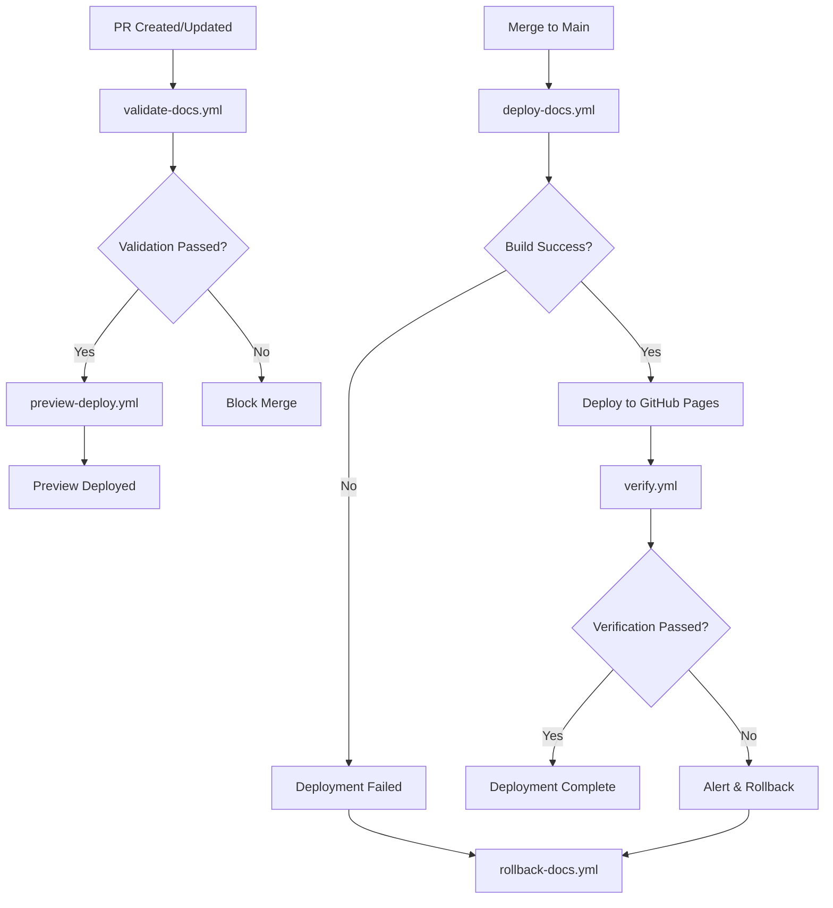

# Story 8.3: CI/CD Pipeline & Automated Deployment

**Epic:** Epic 8 - Deployment & GitHub Pages Publishing
**Story Points:** 6
**Priority:** High
**Status:** Ready for Implementation
**Estimated Page Count:** 12-15 pages

---

## User Story

**As a** documentation maintainer
**I want** automated CI/CD pipeline for documentation deployment
**So that** changes are validated, tested, and deployed automatically

---

## Story Description

### Current System

With Stories 8.1-8.2 completed:
- ✅ MkDocs Material configured
- ✅ Documentation content organized
- ✅ Basic GitHub Actions workflow
- ❌ No comprehensive build validation
- ❌ No link checking automation
- ❌ No deployment previews
- ❌ No rollback procedures

### Enhancement

Implement comprehensive CI/CD pipeline:
- **Build Validation:** Automated checks for errors, warnings, broken links
- **Testing:** Link validation, search index validation, accessibility testing
- **Deployment:** Automatic deployment to GitHub Pages on merge to main
- **Preview Environments:** Deploy previews for pull requests
- **Rollback:** Automated rollback procedures for failed deployments
- **Monitoring:** Deployment status tracking and notifications

---

## Acceptance Criteria

### AC1: Build Validation Workflow
**Given** documentation changes in pull request
**When** CI pipeline runs
**Then** it should validate build quality:

#### 1.1 Build Validation Workflow

**File:** `.github/workflows/validate-docs.yml`

```yaml
name: Validate Documentation

on:
  pull_request:
    branches: [main]
    paths:
      - 'docs/**'
      - 'mkdocs.yml'
      - '.github/workflows/**'

permissions:
  contents: read
  pull-requests: write

jobs:
  validate:
    runs-on: ubuntu-latest
    timeout-minutes: 15

    steps:
      - name: Checkout repository
        uses: actions/checkout@v4
        with:
          fetch-depth: 0  # Full history for git-revision-date

      - name: Setup Python
        uses: actions/setup-python@v4
        with:
          python-version: '3.11'
          cache: 'pip'

      - name: Install dependencies
        run: |
          pip install mkdocs-material
          pip install mkdocs-git-revision-date-localized-plugin
          pip install mkdocs-minify-plugin
          pip install mkdocs-redirects

      - name: Build documentation (strict mode)
        id: build
        run: |
          mkdocs build --strict --verbose 2>&1 | tee build.log
          echo "Build completed"

      - name: Check for warnings
        run: |
          if grep -i "warning" build.log; then
            echo "⚠️ Build warnings detected"
            echo "warnings=true" >> $GITHUB_OUTPUT
          else
            echo "✅ No build warnings"
            echo "warnings=false" >> $GITHUB_OUTPUT
          fi

      - name: Upload build artifacts
        if: always()
        uses: actions/upload-artifact@v3
        with:
          name: build-output
          path: |
            site/
            build.log
          retention-days: 7

  link-check:
    runs-on: ubuntu-latest
    needs: validate
    timeout-minutes: 10

    steps:
      - name: Checkout repository
        uses: actions/checkout@v4

      - name: Setup Python
        uses: actions/setup-python@v4
        with:
          python-version: '3.11'
          cache: 'pip'

      - name: Install dependencies
        run: |
          pip install mkdocs-material
          pip install mkdocs-git-revision-date-localized-plugin
          npm install -g markdown-link-check

      - name: Build documentation
        run: mkdocs build

      - name: Check internal links
        run: |
          echo "Checking internal links..."
          find site -name "*.html" -print0 | xargs -0 -n1 npx broken-link-checker \
            --filter-level 3 \
            --exclude external \
            --ordered \
            --verbose

      - name: Check markdown links
        run: |
          echo "Checking markdown links..."
          find docs -name "*.md" -print0 | xargs -0 -n1 markdown-link-check \
            --config .markdown-link-check.json

      - name: Report link check results
        if: failure()
        uses: actions/github-script@v6
        with:
          script: |
            github.rest.issues.createComment({
              issue_number: context.issue.number,
              owner: context.repo.owner,
              repo: context.repo.repo,
              body: '❌ Link check failed. Please review broken links in the workflow logs.'
            })

  accessibility-check:
    runs-on: ubuntu-latest
    needs: validate
    timeout-minutes: 10

    steps:
      - name: Checkout repository
        uses: actions/checkout@v4

      - name: Setup Python
        uses: actions/setup-python@v4
        with:
          python-version: '3.11'

      - name: Install dependencies
        run: |
          pip install mkdocs-material
          pip install mkdocs-git-revision-date-localized-plugin
          npm install -g pa11y-ci

      - name: Build documentation
        run: mkdocs build

      - name: Run accessibility tests
        run: |
          echo "Running accessibility checks..."
          pa11y-ci --sitemap site/sitemap.xml \
            --threshold 10 \
            --reporter cli

      - name: Upload accessibility report
        if: always()
        uses: actions/upload-artifact@v3
        with:
          name: accessibility-report
          path: pa11y-ci-report.json
          retention-days: 7

  quality-report:
    runs-on: ubuntu-latest
    needs: [validate, link-check, accessibility-check]
    if: always()
    timeout-minutes: 5

    steps:
      - name: Generate quality report
        uses: actions/github-script@v6
        with:
          script: |
            const buildStatus = '${{ needs.validate.result }}';
            const linkStatus = '${{ needs.link-check.result }}';
            const a11yStatus = '${{ needs.accessibility-check.result }}';

            const statusEmoji = (status) => {
              return status === 'success' ? '✅' : status === 'failure' ? '❌' : '⚠️';
            };

            const report = `
            ## Documentation Quality Report

            | Check | Status |
            |-------|--------|
            | Build Validation | ${statusEmoji(buildStatus)} ${buildStatus} |
            | Link Check | ${statusEmoji(linkStatus)} ${linkStatus} |
            | Accessibility | ${statusEmoji(a11yStatus)} ${a11yStatus} |

            ${buildStatus === 'success' && linkStatus === 'success' && a11yStatus === 'success'
              ? '✅ All quality checks passed!'
              : '⚠️ Some quality checks failed. Please review the workflow logs.'}
            `;

            github.rest.issues.createComment({
              issue_number: context.issue.number,
              owner: context.repo.owner,
              repo: context.repo.repo,
              body: report
            });
```

#### 1.2 Link Check Configuration

**File:** `.markdown-link-check.json`

```json
{
  "ignorePatterns": [
    {
      "pattern": "^http://localhost"
    },
    {
      "pattern": "^https://example.com"
    }
  ],
  "replacementPatterns": [
    {
      "pattern": "^/",
      "replacement": "{{BASEURL}}/"
    }
  ],
  "httpHeaders": [
    {
      "urls": ["https://github.com"],
      "headers": {
        "Accept-Encoding": "zstd, br, gzip, deflate"
      }
    }
  ],
  "timeout": "20s",
  "retryOn429": true,
  "retryCount": 3,
  "fallbackRetryDelay": "30s",
  "aliveStatusCodes": [200, 206]
}
```

---

### AC2: Deployment Workflow
**Given** merged changes to main branch
**When** deployment workflow runs
**Then** documentation should be deployed automatically:

#### 2.1 Production Deployment Workflow

**File:** `.github/workflows/deploy-docs.yml`

```yaml
name: Deploy Documentation

on:
  push:
    branches:
      - main
    paths:
      - 'docs/**'
      - 'mkdocs.yml'
      - '.github/workflows/deploy-docs.yml'

  workflow_dispatch:
    inputs:
      version:
        description: 'Version to deploy'
        required: false
        default: 'latest'

permissions:
  contents: write
  pages: write
  id-token: write

# Allow only one concurrent deployment
concurrency:
  group: "pages"
  cancel-in-progress: false

jobs:
  build:
    runs-on: ubuntu-latest
    timeout-minutes: 15

    steps:
      - name: Checkout repository
        uses: actions/checkout@v4
        with:
          fetch-depth: 0  # Full history for git-revision-date

      - name: Setup Python
        uses: actions/setup-python@v4
        with:
          python-version: '3.11'
          cache: 'pip'

      - name: Install dependencies
        run: |
          pip install mkdocs-material
          pip install mkdocs-git-revision-date-localized-plugin
          pip install mkdocs-minify-plugin
          pip install mkdocs-redirects

      - name: Configure Git
        run: |
          git config user.name "github-actions[bot]"
          git config user.email "github-actions[bot]@users.noreply.github.com"

      - name: Build documentation
        run: |
          echo "Building documentation..."
          mkdocs build --strict --verbose

          echo "Build completed successfully"
          echo "Total pages: $(find site -name "*.html" | wc -l)"
          echo "Total size: $(du -sh site | cut -f1)"

      - name: Upload build artifact
        uses: actions/upload-artifact@v3
        with:
          name: documentation-site
          path: site/
          retention-days: 30

      - name: Upload Pages artifact
        uses: actions/upload-pages-artifact@v2
        with:
          path: site/

  deploy:
    runs-on: ubuntu-latest
    needs: build
    timeout-minutes: 10

    environment:
      name: github-pages
      url: ${{ steps.deployment.outputs.page_url }}

    steps:
      - name: Deploy to GitHub Pages
        id: deployment
        uses: actions/deploy-pages@v2

      - name: Create deployment summary
        run: |
          echo "## 🚀 Deployment Summary" >> $GITHUB_STEP_SUMMARY
          echo "" >> $GITHUB_STEP_SUMMARY
          echo "- **URL:** ${{ steps.deployment.outputs.page_url }}" >> $GITHUB_STEP_SUMMARY
          echo "- **Commit:** ${{ github.sha }}" >> $GITHUB_STEP_SUMMARY
          echo "- **Branch:** ${{ github.ref_name }}" >> $GITHUB_STEP_SUMMARY
          echo "- **Deployed at:** $(date -u '+%Y-%m-%d %H:%M:%S UTC')" >> $GITHUB_STEP_SUMMARY

  verify:
    runs-on: ubuntu-latest
    needs: deploy
    timeout-minutes: 10

    steps:
      - name: Wait for deployment
        run: sleep 30

      - name: Verify deployment
        run: |
          SITE_URL="${{ needs.deploy.outputs.page_url }}"

          echo "Verifying deployment at: $SITE_URL"

          # Check homepage
          HTTP_CODE=$(curl -s -o /dev/null -w "%{http_code}" "$SITE_URL")
          if [ "$HTTP_CODE" != "200" ]; then
            echo "❌ Homepage returned HTTP $HTTP_CODE"
            exit 1
          fi
          echo "✅ Homepage accessible (HTTP 200)"

          # Check critical pages
          for page in "getting-started/" "api/overview/" "examples/"; do
            HTTP_CODE=$(curl -s -o /dev/null -w "%{http_code}" "$SITE_URL$page")
            if [ "$HTTP_CODE" != "200" ]; then
              echo "❌ Page $page returned HTTP $HTTP_CODE"
              exit 1
            fi
            echo "✅ Page $page accessible (HTTP 200)"
          done

      - name: Deployment verification report
        if: always()
        run: |
          echo "## 🔍 Deployment Verification" >> $GITHUB_STEP_SUMMARY
          echo "" >> $GITHUB_STEP_SUMMARY
          if [ "${{ job.status }}" == "success" ]; then
            echo "✅ All verification checks passed" >> $GITHUB_STEP_SUMMARY
          else
            echo "❌ Deployment verification failed" >> $GITHUB_STEP_SUMMARY
          fi

  notify:
    runs-on: ubuntu-latest
    needs: [deploy, verify]
    if: always()
    timeout-minutes: 5

    steps:
      - name: Send deployment notification
        uses: actions/github-script@v6
        with:
          script: |
            const deployStatus = '${{ needs.deploy.result }}';
            const verifyStatus = '${{ needs.verify.result }}';

            const statusEmoji = deployStatus === 'success' && verifyStatus === 'success' ? '✅' : '❌';
            const statusText = deployStatus === 'success' && verifyStatus === 'success' ? 'Success' : 'Failed';

            const message = `
            ${statusEmoji} **Documentation Deployment ${statusText}**

            - **Commit:** \`${{ github.sha }}\`
            - **Branch:** \`${{ github.ref_name }}\`
            - **URL:** ${{ needs.deploy.outputs.page_url }}
            - **Deployed at:** ${new Date().toUTCString()}
            `;

            // Create deployment comment on the commit
            github.rest.repos.createCommitComment({
              owner: context.repo.owner,
              repo: context.repo.repo,
              commit_sha: context.sha,
              body: message
            });
```

---

### AC3: Pull Request Preview Deployments
**Given** pull request with documentation changes
**When** PR is opened or updated
**Then** preview deployment should be created:

#### 3.1 PR Preview Workflow

**File:** `.github/workflows/preview-deploy.yml`

```yaml
name: Deploy PR Preview

on:
  pull_request:
    branches: [main]
    paths:
      - 'docs/**'
      - 'mkdocs.yml'
    types: [opened, synchronize, reopened]

permissions:
  contents: read
  pull-requests: write

jobs:
  preview:
    runs-on: ubuntu-latest
    timeout-minutes: 15

    steps:
      - name: Checkout repository
        uses: actions/checkout@v4
        with:
          fetch-depth: 0

      - name: Setup Python
        uses: actions/setup-python@v4
        with:
          python-version: '3.11'
          cache: 'pip'

      - name: Install dependencies
        run: |
          pip install mkdocs-material
          pip install mkdocs-git-revision-date-localized-plugin
          pip install mkdocs-minify-plugin

      - name: Build documentation
        run: |
          mkdocs build --strict

          # Add preview banner
          echo '<div style="background: #ff6b6b; color: white; padding: 10px; text-align: center; position: fixed; top: 0; width: 100%; z-index: 9999;">⚠️ Preview Deployment - PR #${{ github.event.pull_request.number }}</div>' > banner.html
          find site -name "*.html" -exec sed -i '/<body>/r banner.html' {} \;

      - name: Deploy to Netlify (Preview)
        id: netlify
        uses: netlify/actions/cli@master
        with:
          args: deploy --dir=site --message="PR #${{ github.event.pull_request.number }}"
        env:
          NETLIFY_SITE_ID: ${{ secrets.NETLIFY_SITE_ID }}
          NETLIFY_AUTH_TOKEN: ${{ secrets.NETLIFY_AUTH_TOKEN }}

      - name: Comment PR with preview URL
        uses: actions/github-script@v6
        with:
          script: |
            const previewUrl = '${{ steps.netlify.outputs.deploy-url }}';

            const comment = `
            ## 📝 Documentation Preview

            Preview deployment is ready!

            - **Preview URL:** ${previewUrl}
            - **Commit:** \`${{ github.event.pull_request.head.sha }}\`
            - **Built at:** ${new Date().toUTCString()}

            ### Validation Status
            - ✅ Build successful
            - ✅ Preview deployed

            **Note:** This is a preview deployment and will be removed when the PR is closed.
            `;

            // Find existing preview comment
            const { data: comments } = await github.rest.issues.listComments({
              owner: context.repo.owner,
              repo: context.repo.repo,
              issue_number: context.issue.number
            });

            const existingComment = comments.find(c =>
              c.user.login === 'github-actions[bot]' &&
              c.body.includes('Documentation Preview')
            );

            if (existingComment) {
              // Update existing comment
              await github.rest.issues.updateComment({
                owner: context.repo.owner,
                repo: context.repo.repo,
                comment_id: existingComment.id,
                body: comment
              });
            } else {
              // Create new comment
              await github.rest.issues.createComment({
                owner: context.repo.owner,
                repo: context.repo.repo,
                issue_number: context.issue.number,
                body: comment
              });
            }
```

---

### AC4: Rollback Procedures
**Given** failed or problematic deployment
**When** rollback is triggered
**Then** previous version should be restored:

#### 4.1 Rollback Workflow

**File:** `.github/workflows/rollback-docs.yml`

```yaml
name: Rollback Documentation

on:
  workflow_dispatch:
    inputs:
      commit_sha:
        description: 'Commit SHA to rollback to'
        required: true
      reason:
        description: 'Reason for rollback'
        required: true

permissions:
  contents: write
  pages: write
  id-token: write

jobs:
  rollback:
    runs-on: ubuntu-latest
    timeout-minutes: 15

    steps:
      - name: Checkout repository
        uses: actions/checkout@v4
        with:
          fetch-depth: 0
          ref: ${{ github.event.inputs.commit_sha }}

      - name: Validate commit
        run: |
          git log -1 --format="%H %s" ${{ github.event.inputs.commit_sha }}

          if [ $? -ne 0 ]; then
            echo "❌ Invalid commit SHA"
            exit 1
          fi

      - name: Setup Python
        uses: actions/setup-python@v4
        with:
          python-version: '3.11'
          cache: 'pip'

      - name: Install dependencies
        run: |
          pip install mkdocs-material
          pip install mkdocs-git-revision-date-localized-plugin
          pip install mkdocs-minify-plugin

      - name: Build documentation
        run: |
          echo "Building documentation from commit ${{ github.event.inputs.commit_sha }}"
          mkdocs build --strict --verbose

      - name: Upload Pages artifact
        uses: actions/upload-pages-artifact@v2
        with:
          path: site/

      - name: Deploy to GitHub Pages
        id: deployment
        uses: actions/deploy-pages@v2

      - name: Create rollback issue
        uses: actions/github-script@v6
        with:
          script: |
            const issue = await github.rest.issues.create({
              owner: context.repo.owner,
              repo: context.repo.repo,
              title: `Documentation Rollback: ${new Date().toISOString().split('T')[0]}`,
              body: `
              ## Rollback Summary

              - **Rolled back to commit:** \`${{ github.event.inputs.commit_sha }}\`
              - **Reason:** ${{ github.event.inputs.reason }}
              - **Triggered by:** @${{ github.actor }}
              - **Timestamp:** ${new Date().toUTCString()}

              ## Actions Required

              - [ ] Investigate root cause
              - [ ] Fix issues in new commit
              - [ ] Test thoroughly before redeployment
              - [ ] Document lessons learned

              ## Deployment URL

              ${{ steps.deployment.outputs.page_url }}
              `,
              labels: ['rollback', 'documentation', 'incident']
            });

            console.log(\`Created issue #\${issue.data.number}\`);
```

---

## Technical Implementation Notes

### Workflow Dependencies



### Environment Variables

**GitHub Secrets Required:**
- `GITHUB_TOKEN` - Automatically provided by GitHub Actions
- `NETLIFY_SITE_ID` - Netlify site ID for preview deployments (optional)
- `NETLIFY_AUTH_TOKEN` - Netlify authentication token (optional)

### Build Performance Optimization

**Caching Strategy:**
```yaml
- name: Cache pip dependencies
  uses: actions/cache@v3
  with:
    path: ~/.cache/pip
    key: ${{ runner.os }}-pip-${{ hashFiles('**/requirements.txt') }}
    restore-keys: |
      ${{ runner.os }}-pip-

- name: Cache MkDocs build
  uses: actions/cache@v3
  with:
    path: .cache
    key: mkdocs-${{ github.sha }}
    restore-keys: |
      mkdocs-
```

### Deployment Monitoring

**Health Check Script:**
```bash
#!/bin/bash
# check-deployment.sh

SITE_URL="$1"
CRITICAL_PAGES=(
  ""
  "getting-started/"
  "api/overview/"
  "examples/"
  "multi-instance/overview/"
)

echo "🔍 Checking deployment at: $SITE_URL"

for page in "${CRITICAL_PAGES[@]}"; do
  URL="${SITE_URL}${page}"
  HTTP_CODE=$(curl -s -o /dev/null -w "%{http_code}" "$URL")

  if [ "$HTTP_CODE" != "200" ]; then
    echo "❌ FAILED: $URL (HTTP $HTTP_CODE)"
    exit 1
  fi

  echo "✅ OK: $URL"
done

echo "✅ All critical pages accessible"
```

---

## Dependencies

### Upstream Dependencies
- Story 8.1 (GitHub Pages Setup) - MkDocs configuration
- Story 8.2 (Site Structure) - Content organization

### Downstream Dependencies
- Story 8.4 (Production Deployment) - Uses CI/CD workflows

### External Dependencies
```
# requirements.txt
mkdocs-material==9.5.3
mkdocs-git-revision-date-localized-plugin==1.2.2
mkdocs-minify-plugin==0.8.0
mkdocs-redirects==1.2.1

# Node.js dependencies (for validation)
markdown-link-check
broken-link-checker
pa11y-ci
```

---

## Definition of Done

### Workflow Implementation
- [ ] Build validation workflow created and tested
- [ ] Deployment workflow configured
- [ ] PR preview workflow operational
- [ ] Rollback procedure documented and tested
- [ ] All workflows passing on test runs

### Quality Checks
- [ ] Link checking automated
- [ ] Accessibility testing implemented
- [ ] Build warnings detection configured
- [ ] Deployment verification tests passing

### Monitoring & Notifications
- [ ] Deployment status notifications
- [ ] Failed deployment alerts
- [ ] Quality report comments on PRs
- [ ] Rollback incident tracking

### Documentation
- [ ] CI/CD pipeline documented
- [ ] Rollback procedure guide
- [ ] Troubleshooting common issues
- [ ] Workflow maintenance guide

---

## Estimation Breakdown

**Story Points:** 6

**Effort Distribution:**
- Build validation workflow: 1.5 SP
- Deployment workflow: 1.5 SP
- PR preview workflow: 1.5 SP
- Rollback procedures: 1 SP
- Testing & validation: 0.5 SP

**Page Count:** 12-15 pages

**Estimated Duration:** 2-3 days (1 DevOps engineer)

---

## Notes

### Success Metrics
- Build validation runs in <5 minutes
- Deployment completes in <10 minutes
- 100% of deployments verified automatically
- Zero failed deployments without rollback
- PR previews available within 3 minutes

### Common Mistakes to Avoid
- ❌ Not validating builds before deployment
- ❌ Missing rollback procedures
- ❌ No deployment verification
- ❌ Ignoring accessibility checks
- ❌ Not caching dependencies (slow builds)

### Best Practices
- ✅ Strict mode builds catch errors early
- ✅ Comprehensive link checking prevents broken links
- ✅ PR previews enable review before merge
- ✅ Automated rollback minimizes downtime
- ✅ Quality reports provide visibility

---

**Status:** Ready for Implementation
**Related Files:**
- `.github/workflows/validate-docs.yml`
- `.github/workflows/deploy-docs.yml`
- `.github/workflows/preview-deploy.yml`
- `.github/workflows/rollback-docs.yml`
- `.markdown-link-check.json`
- `requirements.txt`
